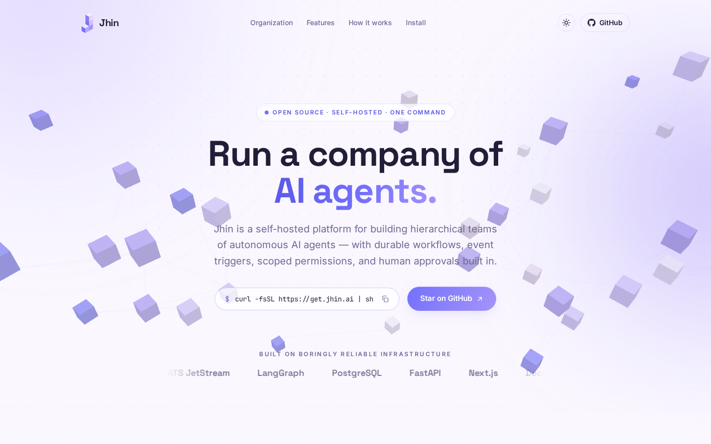
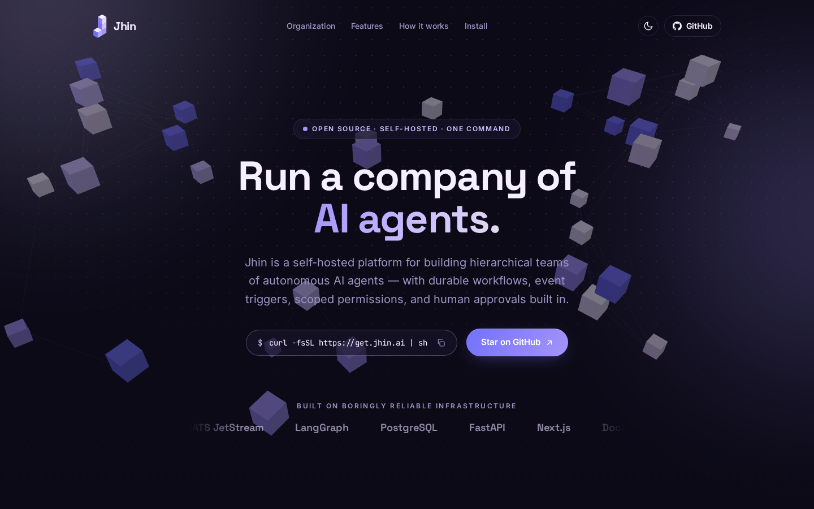
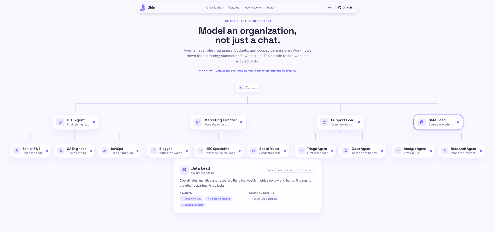

<p align="center">
  
</p>

<h1 align="center">Jhin — Landing Page</h1>

<p align="center">
  The marketing site for <strong>Jhin</strong>, a self-hosted, open-source platform for running hierarchical teams of autonomous AI agents.
</p>

<p align="center">
  <a href="https://jhin.ai">jhin.ai</a> ·
  <a href="https://github.com/jhin-ai/jhin">Jhin project repo</a>
</p>

<p align="center">
  
  
  
  
  
</p>

---

<p align="center">
  
  
</p>

## What is this?

This repo contains only the landing page for Jhin — a single, fully static Next.js site that explains what Jhin is, shows how it works, and links to the main project. The Jhin platform itself (Temporal workflows, NATS events, LangGraph agents, connectors, approvals) lives in its own repository.

**What is Jhin?** A self-hostable operating system for teams of AI workers. You model an organization — a CTO agent managing engineers, a marketing director managing writers — and agents pick up real work through triggers (like a Linear issue entering Todo), execute it in sandboxes with least-privilege credentials, and route risky actions through human approval. Installed with a single command, run entirely on your own hardware.

## Page highlights

- **Scroll-assembled hero** — a Three.js constellation of 32 floating isometric cubes that flies together into the Jhin tetris-J as you scroll, scrubbed to scroll position and fully reversible
- **Org chart scroll story** — a pinned section where an example organization (Engineering, Marketing, Support, Data) assembles department by department; every node is tappable and shows that agent's granted/denied permissions
- **Interactive logo** — hover the nav logo and the J breaks into its four cubes and reassembles
- **Animated install terminal** — types out the install command and simulated output when scrolled into view
- **Dark & light themes** — follows system preference with a manual toggle; the WebGL scene, terminal, and all surfaces adapt
- **Fully static** — no server-side logic, deployable anywhere
- **Accessible motion** — every animation (including the hero pin and WebGL assembly) is disabled or simplified under `prefers-reduced-motion`

<p align="center">
  
</p>

## Tech stack

| | |
|---|---|
| Framework | [Next.js 16](https://nextjs.org) (App Router, static prerender) |
| Styling | [Tailwind CSS v4](https://tailwindcss.com) + CSS custom properties |
| Scroll & UI animation | [GSAP](https://gsap.com) + ScrollTrigger |
| 3D hero | [Three.js](https://threejs.org) |
| Fonts | Space Grotesk, Inter, JetBrains Mono — self-hosted via [Fontsource](https://fontsource.org) (no external font requests) |

## Getting started

Requires Node.js 20+.

```bash
git clone https://github.com/Teachmetech/Jhin-Landing.git
cd Jhin-Landing
npm install
npm run dev
```

The dev server runs at **http://localhost:3001**.

Production build:

```bash
npm run build
npm start
```

## Project structure

```
app/
  layout.tsx        # fonts, metadata, theme-init script (no-FOUC dark mode)
  page.tsx          # section composition
  globals.css       # Pastel Skies design tokens, org-tree CSS, keyframes
  icon.svg          # favicon (square-cropped logo)
components/
  Hero.tsx          # sticky 2-screen hero, copy fade-out on scroll
  HeroScene.tsx     # Three.js scene + scroll-driven voxel-J assembly
  OrgChart.tsx      # pinned scroll story, scale-to-fit tree, detail panel
  Workflow.tsx      # ticket-to-merge timeline with scrubbed progress rail
  Install.tsx       # animated terminal + install CTA
  LogoMark.tsx      # inline SVG logo with hover disassemble/reassemble
  Features.tsx, Nav.tsx, Footer.tsx, CopyCmd.tsx, ThemeToggle.tsx, icons.tsx
lib/
  site.ts           # GitHub URL + install command — edit these
public/
  logo.svg          # full logo
  mark.svg          # tight-cropped mark used in nav/footer
docs/               # README screenshots
```

## Customization

- **Links & install command** — everything points through `lib/site.ts`; change `GITHUB_URL` and `INSTALL_CMD` in one place.
- **Colors** — the entire palette is CSS variables in `app/globals.css` (`:root` for light, `.dark` for dark), derived from the Pastel Skies palette:

  | | Name | Hex |
  |---|---|---|
  | 🟣 | Medium Slate Blue | `#7371fc` |
  | 🟪 | Soft Periwinkle | `#a594f9` |
  | 💜 | Periwinkle | `#cdc1ff` |
  | 🤍 | Lavender Veil | `#e5d9f2` |
  | ⬜ | Lavender Mist | `#f5efff` |

- **Org chart content** — agents, permissions, and the scroll-story captions are plain data at the top of `components/OrgChart.tsx`.
- **Port** — `dev`/`start` are pinned to `3001` in `package.json`; change or remove `-p 3001` if you prefer the default.

## License

[MIT](LICENSE)
